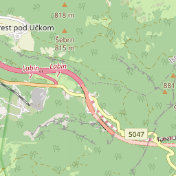

# Testing Tile Server

A miniature tile server, intended to test and calibrate FMTC, has been included in the project.


Avoid making too many costly and slow requests to your chosen tile server during development by using this miniature tile server!


For internal testing and development purposes, it also doubles down as a handy way to test your application without making too many costly and slow requests to your chosen tile server. When in use with the example application, it can handle over 2000 tiles/second.

It is a very simple web HTTP server written in Dart, that responds to all\* requests with a tile. There is a theoretically 90% chance that this tile will be a specific land tile, and a 10% chance that it will be a sea tile - designed to test the sea tile skipping functionality. _There are only these two tiles - it is not a full tile server._

<figure><figcaption>
<em>the</em> Land Tile 90% chance
</figcaption></figure> <figure><figcaption>
<em>the</em> Sea Tile 10% chance
</figcaption></figure>

To use this tile server:


The tile server is hardcoded to use standard HTTP port 7070 to serve content, which is usually free. Other programs must not be using this port.


1. Download/compile & start the tile server (no permanent installation required)
   * On Windows or Linux\
     Download a copy of the latest '\<platform>-ts' artifact from GitHub Actions, and run the executable inside: [https://nightly.link/JaffaKetchup/flutter\_map\_tile\_caching/workflows/main/main](https://nightly.link/JaffaKetchup/flutter_map_tile_caching/workflows/main/main)
   * On other platforms\
     Clone the [FMTC GitHub repository](https://github.com/JaffaKetchup/flutter_map_tile_caching/) to your device, then run '/tile\_server/bin/tile\_server.dart' manually
2. Use the following URL to connect to it
   * From the local device: `http://localhost:7070/{z}/{x}/{y}.png`
   * From the same network (on another device): `http://<your-local-ip>:7070/{z}/{x}/{y}.png`\
     To find your local IP address, follow the [instructions for your OS here](https://www.avast.com/c-how-to-find-ip-address)
3. Control the tile server using keyboard key presses in the console window
   * `q`: Release port 7070 and quit the executable
   * UP arrow: Increase the artificial delay between request and response by 2ms
   * DOWN arrow: Decrease the artificial delay between request and response by 2ms
